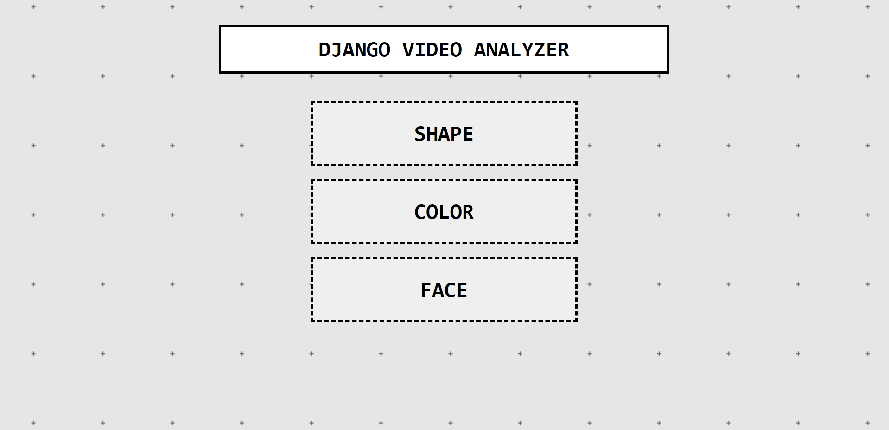
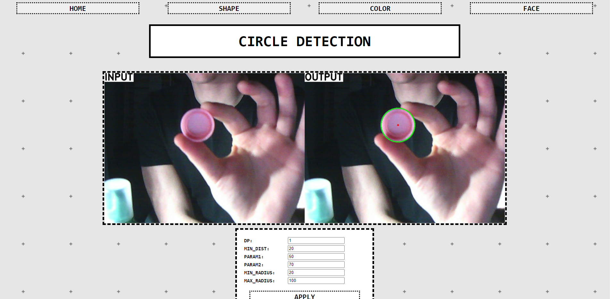
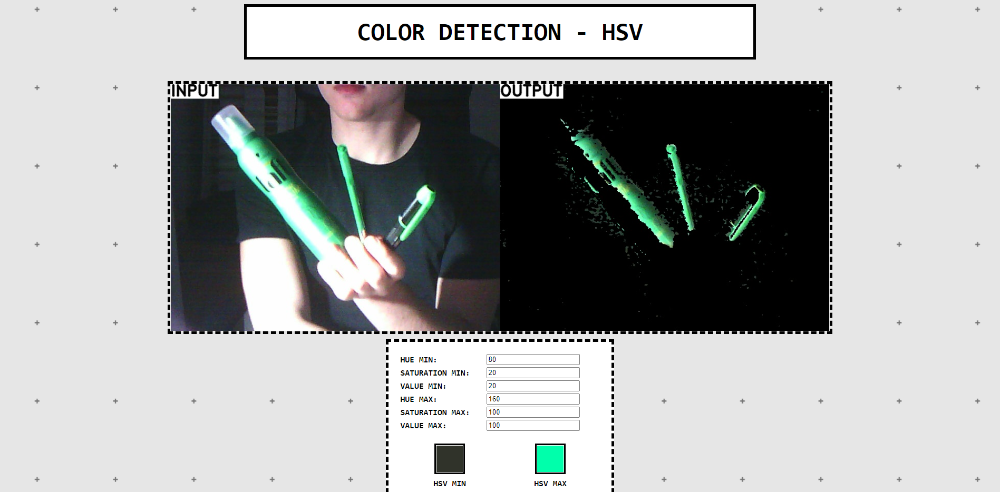
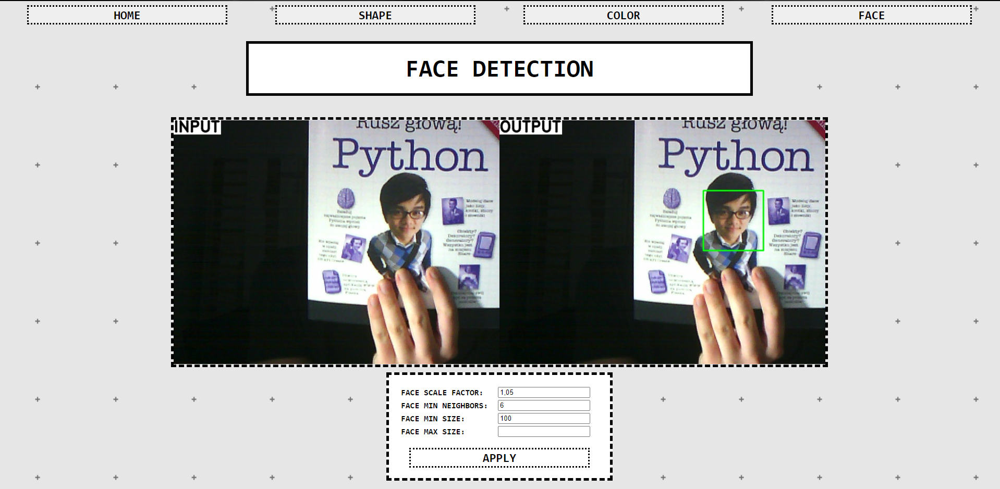

# Django Video Analyzer
> This application enables to capture image from webcam and detect shapes, color and faces on it.
## Table of contents
* [Screenshots](#screenshots)
* [Technologies](#technologies)
* [How it work?](#how-it-works)
* [Setup](#setup)
* [Features](#features)
* [Status](#status)
* [Contact](#contact)

## Screenshots

* Home page

* Shape detection example

* Color detection example

* Face detection example

## Technologies
* Python 3.9.2
* Django 3.2.3
* numpy 1.20.3
* opencv-python 4.5.2.52

## Setup
To install and run app you will need to:
* Clone this repository to your computer or unpack .zip file in chosen directory,
* Run IDE or command line,
* Command in IDE to install demanded packages:
> pip install -r requirements.txt
* Run comand line,
* Type "cd YOUR_DIRECTORY\videoanalyzer" in command line,
* Type "python manage.py migrate" in command line, 
* Type "python manage.py runserver 8000" in command line,
* Type "http://127.0.0.1:8000/" in your webbrowser.

## Features

* Detecting circles, triangles and squares and indicating them on screen,
* Detecting color set in RGB or HSV scale,
* Detecting faces and eyes.

## Status
Ready to use.
## Contact
Created by [@matedawid](https://linkedin.com/in/matedawid) - if you have any questions, just contact me!
